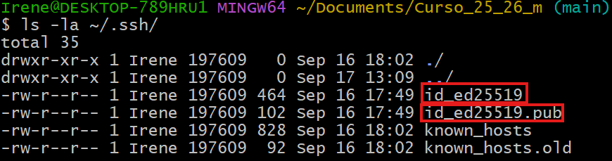
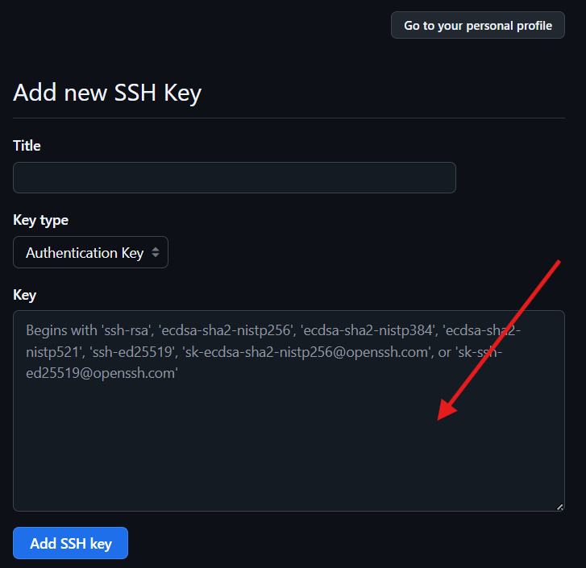
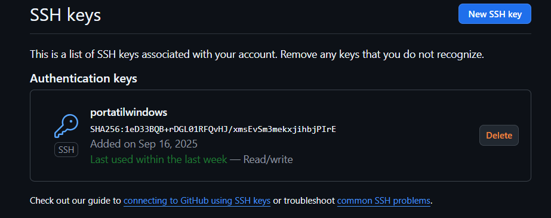
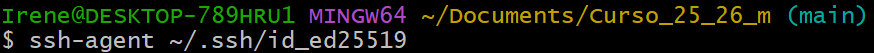
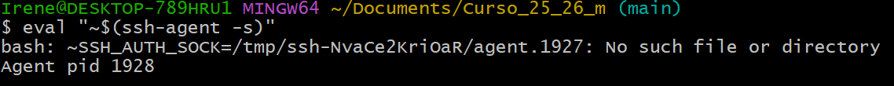

# Manual configurar github por ssh

## Instalacion de la clave en Github


Generamos la clave mediante el siguiente comando

```bash
$ ssh-keygen -t ed25519 -C "tu_correo_asociado_a_tu_cuenta_github@example.com"
```

Verificamos la clave mediante el siguiente comando

```bash
$ ls -la ~/.ssh/"
```

Deberia salir una salida por consola tal que la siguiente imagen:



La clave con terminacion **.pub** (publica) sera la que continuaremos usando ; mientra la que prescinde de la misma es la clave privada que no debemos compartir con nadie

<br>


<br>


Mediante la siguiente linea de comandos , pediremos a la consola que nos muestre la clave 
Importante debemos agregar **.pub** para indicar que queremos la clave publica, si damos la privada estamos muertos.

```bash
$ cat ~/.ssh/id_ed25519.pub
```

Posteriormente copiamos dicha clave y nos vamos al navegador a la ventada de Github donde has de seguir estos pasos

    1. Pinchar en tu foto de perfil

    2. Pulsa en Ajustes (o Settings si lo tienes en ingles) 

    3. Dentro del bloque de Access entrar en SSH and GPG keys
    4. Clickar en New SSH Key
    5. Indicas el nombre de la llave

    6. Seleccionamos Llave de Autentificacion (Authentication Key)

    7. En el bloque siguiente (abajo) pegamos la clave que nos dio la consola de GitBash al ejecutar la anterior linea
    


    8. Pulsar Add SSH key

Te aparecera asi 



## Anadir la clave a Agent

Proseguimos ejecutando la siguiente linea de comando la cual

```bash
$ ssh-add ~/.ssh/id_ed25519
```

### Resultado Foto


## Verificar la clave

Ingresando en la consola de GitBash la siguiente linea de comandos verificaremos la exitencia de la clave
```bash
$ eval "~$(ssh-agent -s)"
```
Si todo esta correcto pues te saldra un pid 
```bash
Agent pid 1928
```
### Resultado Foto




